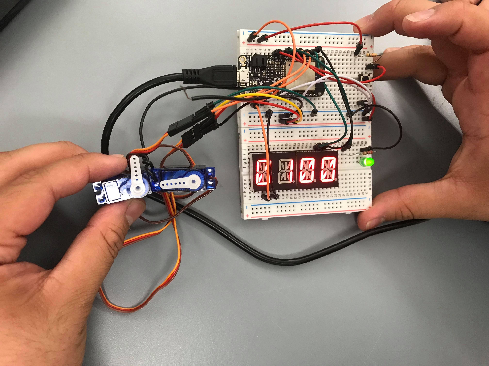

# Pseudo-Mechanical Clock

Authors: Carlos Callejas, Devin Chen, Mahdiul Chowdhury, 2018-09-24

## Summary

We connected two servos and an alphanumeric with the esp32 to function as a simple alarm clock. The two servos told time in minutes and seconds while the alphanumeric display showed hours and minutes. We also implemented functionality to update the time and to set an alarm.

## Evaluation Criteria

- Displays time on servo and alphanumeric display with second and minute accuracy respectively
- Able to set alarm and trigger led
- Able to set/update time easily
- Able to be stopped using a stop button for changing/updating variables (alarm and time)

## Solution Design

We used timer based interrupts to keep time and communicated to the alphanumeric display via i2c. In order to set/update the time/alarm and start the clock, we made a "menu" type interface through the console. In order to stop the clock, a (debounced) GPIO button interrupt is used to stop the clock and re-enter the menu. The servo positions are updated through timer interrupts.

## Sketches and Photos

Wiring setup implementing two servos and alphanumeric display

## Modules, Tools, Source Used in Solution

- [Adafruit LED Backpack Library](https://github.com/adafruit/Adafruit_LED_Backpack/blob/master/Adafruit_LEDBackpack.cpp)
- [I2C api for esp32](https://docs.espressif.com/projects/esp-idf/en/latest/api-reference/peripherals/i2c.html)
- ESP32 examples:
  * Timer group interrupt
  * i2c 
  * mcpwm servo control
  * gpio interrupt 

## Supporting Artifacts

- [Github repo](https://github.com/BU-EC444/Callejas-Chen-Chowdhury)
- [Video Demo](https://drive.google.com/open?id=1S-sGJPTpKSrNGTdECXs99ebFIL36Gwgu)

-----

## Reminders

- Please remember to post a link to this report.md file on [Piazza](https://piazza.com/class/jja9ukam6dp48f) including references to each team member.
- Video recording not to exceed 90s
- Each team member appears in video
- Repo is private
